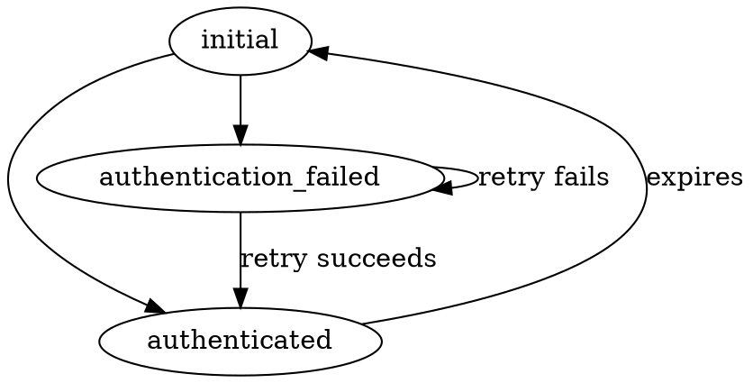

## Hacking

Set up `.env`

`yarn test`

## To Do

1. Allow one-click retry
2. Literate template YAML
3. `.env` or something to make local development/deployment less annoying
4. Make sure retry still works

## Possible future ideas

1. One-off request links
1. Resume even after closing browser (store session ID in localStorage, derive filename from checksum)
1. Upload an entire directory (client side ZIP)
2. End-to-end encryption from browser to download
3. Try S3 transfer acceleration first, fall back to whitelabel domain?

## Known issues

1. ~Upload of a 1.5GB file aborts in Chrome on Linux, readerror type thing~
1. ~Uses way too much memory uploading a 3GB file in Safari. I think streaming is keeping the file blob loaded in memory anyway.~
1. Can't download files with emoji in the name

rankdir=LR;

